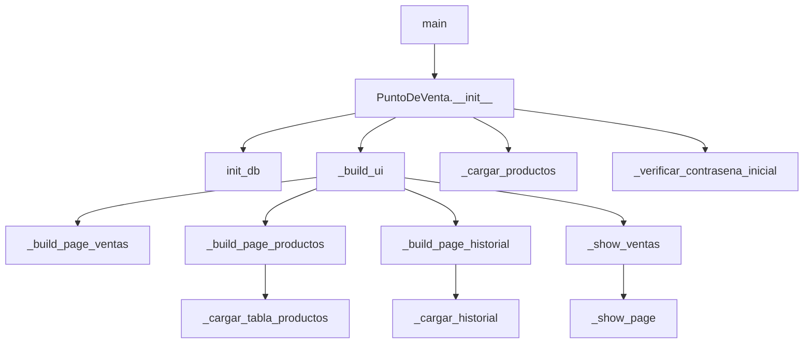
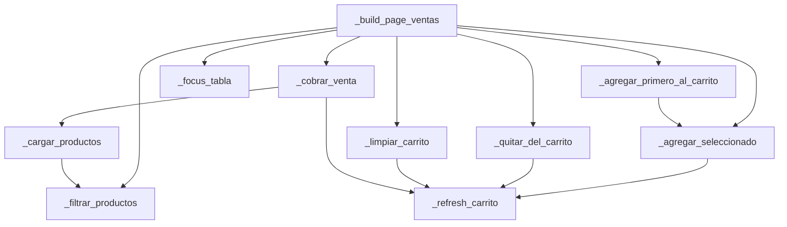
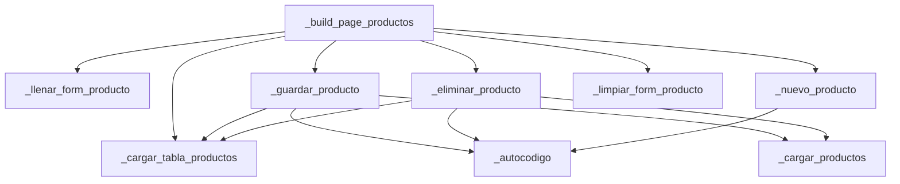
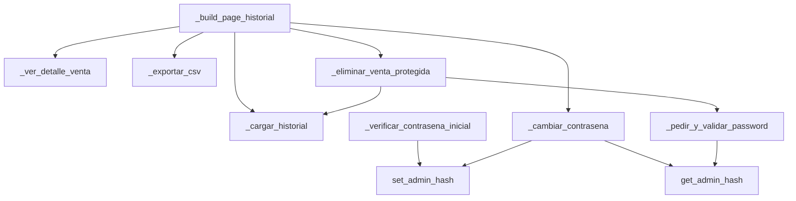

# Mapa visual de arquitectura (Punto de Venta)

Este documento muestra el flujo principal de llamadas entre métodos de `PuntoDeVenta` y propone el **primer refactor recomendado**.

## 1) Vista de alto nivel

## 2) Mapa “qué método llama a cuál” por módulo funcional

### A. Ventas

### B. Productos

### C. Historial + seguridad admin

## 3) Dependencias y acoplamientos clave

- La clase `PuntoDeVenta` concentra UI + reglas + SQL directo.
- Casi todos los métodos de flujo invocan `get_conn()` y hacen consultas dentro del handler de evento.
- El estado de UI y dominio está mezclado (`self.carrito`, `StringVar`, selección de tablas, etc.).

## 4) Primer refactor recomendado (mínimo riesgo, alto impacto)

### Objetivo
Separar acceso a datos (SQLite) de la UI sin cambiar comportamiento visible.

### Paso 1 (primer sprint)
Crear una capa repositorio: `repositorio_pos.py` con funciones/métodos como:

- `listar_productos()`
- `buscar_productos(q)`
- `guardar_producto(...)`
- `eliminar_producto(id)`
- `registrar_venta(carrito)`
- `listar_ventas(fecha=None, limit=200)`
- `detalle_venta(venta_id)`
- `kpis_hoy()`
- `leer_admin_hash()/guardar_admin_hash()`

### Qué mover primero
1. **Lecturas puras** (sin efectos):
   - `_cargar_productos`, `_cargar_tabla_productos`, `_cargar_historial`, `_ver_detalle_venta`.
2. **Después transacciones**:
   - `_cobrar_venta`, `_eliminar_venta_protegida`.

### Beneficios inmediatos
- Menor complejidad en la clase Tkinter.
- Más fácil testear reglas sin abrir UI.
- Menor riesgo al introducir nuevas funciones (cortes de caja, reportes, etc.).

## 5) Orden sugerido de refactor (práctico)

1. Introducir `repositorio_pos.py` manteniendo la API actual.
2. Cambiar sólo llamadas de lectura en UI.
3. Agregar pruebas unitarias de repositorio con SQLite temporal.
4. Migrar operaciones de escritura/transacción.
5. Evaluar un segundo paso: `servicios_pos.py` para reglas (stock, ganancia, validaciones).

